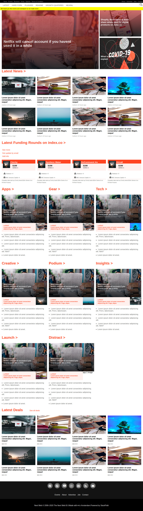

## Responsive Design

Microverse project focused on learning Responsive Design using mobile first approach. We clone TheNextWeb

## Screenshot :camera:


The page is a copy of https://thenextweb.com.

## Built With

- Html
- CSS(Flexbox, Grid)

## Live Demo 🚀

  [Responsive-Design](https://haroonabdulrazaq.github.io/Responsive-Design/)
  # Getting Started 🚀

These instructions will get you a copy of the project up and running on your local machine.


## How To Use 🔧

From your command line, first clone the project:

```bash
# Clone this repository
$ git clone https://github.com/Haroonabdulrazaq/Responsive-Design

# Go into the repository
$ cd Responsive-Design
```
## Install
- No installation for this project

## Set up
- Clone this Project to your local machine
- Change directory into this project
- Open it in your prefered IDE(Integrated Development Environment)

## Prerequisite
- Integrated Development Evnvironment

## Test
- [HTML Validator](https://validator.w3.org/)
- CSS code (Stickler CI)

## Deployment

- Deployed Using Github ```gh-pages```

## Authors

👤 **Author 1**

- Github: [@talhawaqar](https://github.com/talhawaqar)
- Linkedin: [@talha-waqar](https://www.linkedin.com/in/talha-waqar-977257145/)
- Twitter: [@MuhammadTalhaW4](https://twitter.com/MuhammadTalhaW4)
- email: (talhawaqar007@hotmail.com)
- email-2: (talhawaqar007@gmail.com)

👤 **Author 2**

- Github: [@Haroonabdulrazaq](https://github.com/Haroonabdulrazaq)
- Linkedin: [@Haroonabdulrazaq](https://www.linkedin.com/in/haroon-abdulrazaq-817906100/)
- Twitter: [@Hanq_o](https://twitter.com/Hanq_o)
- Email: (Haroonabdulrazaq@gmail.com)

## 🤝 Contributing

Contributions, issues and feature requests are welcome! Start by:

- Forking the project
- Cloning the project to your local machine
- `cd` into the project directory
- Run `git checkout -b your-branch-name`
- Make your contributions
- Push your branch up to your forked repository
- Open a Pull Request with a detailed description to the development branch of the original project for a review

## Show your support

Give a ⭐️ if you like this project!

## Acknowledgments

- Project originally taken from The Odin Project
- Project inspired by Microverse Program

## 📝 License

This project is [MIT](https://opensource.org/licenses/MIT) licensed.
